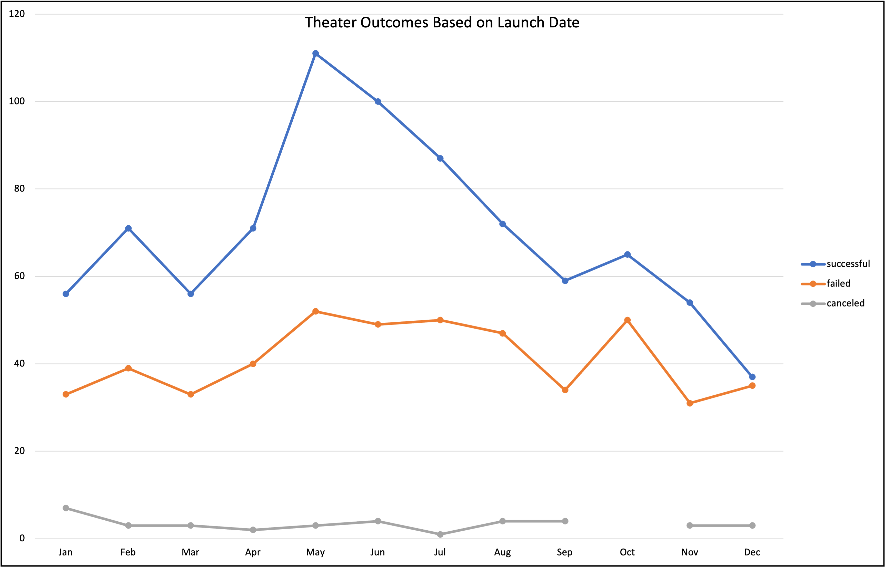
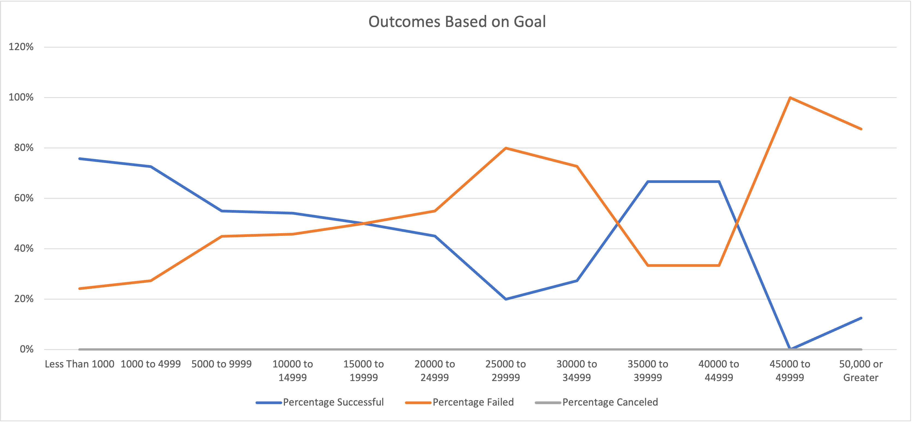

# An Analysis of Kickstarter Campaigns
Performing analysis on Kickstarter data to uncover trends 
## Findings
### There were 525 successful theater Kickstarters in the US

### Great Britain only had a total of 604 Kickstarter campaigns but the theater category was the most successful
Within the theater category, plays specifically had the most amount of successful launches.  

### The month of May had the most successful Kickstarter campaign launches 

### The average goal of successful Kickstarter campaigns for plays in the US was $5,049 with an average pledged amount of $5,602
Failed Kickstarter campaigns had much higher fundraising goals than successful Kickstarter campaigns. 
### The average donation amount for successful play Kickstarters in the US was around $82
## Recommendations
### Louise should launch her Kickstarter campaign just in the US first
### Louise should launch her Kickstarter campaign in the month of May
### Louise should lower her Kickstarter goal, closer to $5,000

# Kickstarting with Excel

## Overview of Project
Analyzing Kickstarter data to uncover trends.

### Purpose
The purpose of this analysis is to understand how Kickstarter launch dates and funding goals impacted overall performance. 

## Analysis and Challenges

### Analysis of Outcomes Based on Launch Date
In this analysis we used the outcome and date created data from all theater campaigns to see the correlation between the month the campaign was launched and the outcome of the campaign (successful, failed, or canceled).

### Analysis of Outcomes Based on Goals
In this analysis we used the goal amount and outcome data from all play campaigns. We created goal ranges and identified the number of successful, failed, or canceled play campaigns with a goal in each respective range. We used the percentage of each outcome for each goal range to see how the goal of a campaign impacted its outcome.

### Challenges and Difficulties Encountered
One challenge I experienced was creating the Outcomes Based on Goal line chart from the table I created. I was not able to format the chart correctly and get the percentage successful/failed/canceled values displayed appropriately. To fix this, I copied the goal, percentage successful, percentage failed, and percentage canceled columns only to a separate worksheet and from there I was able to insert a line chart that displayed the correct axes and series. 

## Results

- What are two conclusions you can draw about the Outcomes based on Launch Date?
  - Based on this dataset, we can conclude that the month of May is the best time to launch a theater Kickstarter campaign because these campaigns had the highest rate of success compared to other months. We can also conclude that December is the worst month to launch a theater campaign because campaigns launched in December had the lowest success rate.  

- What can you conclude about the Outcomes based on Goals?
  - We can conclude that plays with a smaller goal amount, $0-$4999, have a higher rate of success. Plays that had a goal of less than $1000 had the highest percentage of successful launches but a smaller total project count. Plays with a goal of $1000-$4999 had the highest amount of successful campaign launches and the highest project count as well. There are a few outliers in this dataset, but most projects had a goal between $1000-$4999 and the majority of projects with a goal of $15,000 or higher were much less successful.    

- What are some limitations of this dataset?
  - This dataset does not identify the genre associated with each play, musical, film, etc. which would be useful information to analyze to see if there are any trends with specific genres. The age of this data is also another limitation as we only have data through 2017 so we would likely need more up to date information to draw more relevant conclusions.

- What are some other possible tables and/or graphs that we could create?
  - We could create a Box and Whisker Plot to visualize the main spread of data and isolate the outliers.
